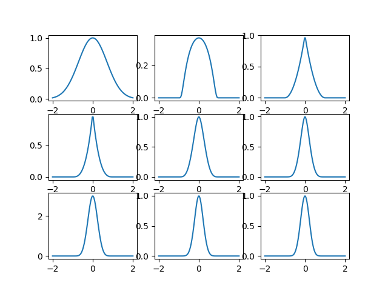
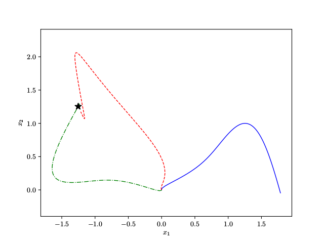
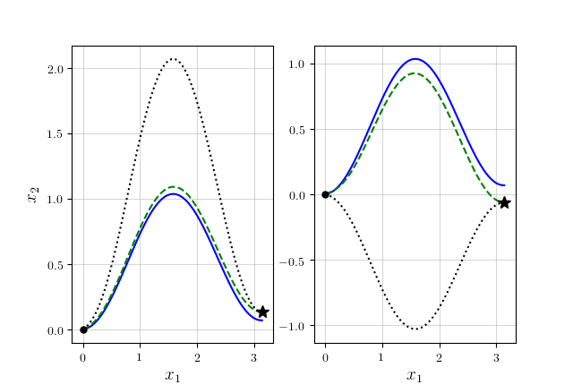

# README #

This repository contains the implementation of Dynamic Movement Primitives, in Python 3.5.

In particular, this repository contains all the synthetic tests done for the work

_GINESI, Michele; SANSONETTO, Nicola; FIORINI, Paolo._ **Overcoming some drawbacks of dynamic movement primitives.** Robotics and Autonomous Systems, 2021, 144: 103844.

https://doi.org/10.1016/j.robot.2021.103844

File gsf21.bib contains the bibentry. Please refer to this work when using the package!

## Installation ##

The package can be installed by running

```
pip install -e .
```

or

```
pip3 install -e .
```

## Usage ##

After installation, you can import the DMP class as

```
from dmp.dmp_cartesian import DMPs_cartesian as dmp
```

After importing, you can create a class using

```
MP = dmp()
```

You can personalize the parameters using keywoard arguments, use the help for additional details.
After importing, you can create a trajectory and learning it.

```
t = np.linspace(0, np.pi, 100)
X = np.transpose(np.array([t * np.cos(2 * t), t * np.sin(2 * t), t * t]))
MP.imitate_path(X)
```

Finally, you can execute a DMP using

```
x_track, _, _, _ = MP.rollout()
```

See the _demos/_ folder to see scripts in which various options are tested and compared, as well as how to change start and goal position

## Contents ##

This repository contains two folders, namely _dmp/_ and _demos/_.
The _dmp/_ folder contains all the functions needed to implement DMPs, while the _demo/_ folder contains the scripts used to perform the tests presented on the paper.

#### _dmp/_ ####

_dmp/_ contain the following files:
* _cs.py_ implements the Canonical System class, together with its methods.
* _derivative_matrices.py_ implements the following two functions:
  * `compute_D1(n, dt)` returns the matrix which discretize the first derivative of a 1D function discretized on an equispaced time domain of `n` points and `dt` timestep, using a second orde estimate;
  * `compute_D2(n, dt)` returns the matrix which discretize the second derivative of a 1D function discretized on an equispaced time domain of `n` points and `dt` timestep, using a second orde estimate.
* _dmp_cartesian.py_ implements the DMP class, together with its methods.
* _exponential_integrator.py_ implements the functions needed to perform an integration step using the Exponential Euler method. In particular the function `exp_eul_step(y, A, b, dt)` returns the solution at time $ n+1$, computed as $ y_{n+1} = y_n + k \varphi_1(k A) (A y_n + b(t_n)) $ for the problem $ \dot{y} = A y + b(t) $, with $y_n$ = `y`, $A$ = `A`, $b(t_n)$ = `b`, and $k$ = `dt`.
* _rotation_matri.py_ implements the functions needed to compute the roto-dilatation matrix. In particular, `roto_dilatation(x0, x1)` returns the roto-dilatation matrix which maps `x0` to `x1`.

#### _demos/_ ####

_demos/_ contain the following files:
* _demo_basis.py_ tests the accuracy in the approximation of a given function using different types of basis functions (Gaussian, trucated Gaussians, Wendland, and Mollifier-like). See Figure 2 of the paper.
* _demo_regression.py_ tests the learning-from-multible-observations porcess using a set of trajecotries obtained by integrating a known dynamical system. See Figure 4a-4b of the paper.
* _demo_rescaling.py_ tests on the robustness of DMP against modification of the relative position between starting and ending points, with and without exploiting the invariance property. See Figure 3 of the paper.
* _demo_rescaling_1.py_ additional tests on the robustness of DMP against modification of the relative position between starting and ending points, with and without exploiting the invariance property.

## (Quick) DMP Overview ##

### Formulation ###

The term _Dynamic Movement Primitives_ (DMPs) refers to a framework for trajectory learning based on second order ODE of spring-mass-damping type:
$$ \begin{cases}
    \tau \dot{\mathbf{v}} = \mathbf{K} (\mathbf{g} - \mathbf{x}) - \mathbf{D} \mathbf{v} - \mathbf{K} ( \mathbf{g} - \mathbf{x}_0 ) s + \mathbf{K} \mathbf{f}(s) \\
    \tau \dot{\mathbf{x}} = \mathbf{v}
\end{cases} , $$
where $\mathbf{x, v, g, x_0, f} \in \mathbb{R}^d$ are, respectively, position and velocity of the system, goal and starting positions, and the non-linear forcing term. Matrices $\mathbf{K,D}\in\mathbb{R}^{d\times d}$ are diagonal matrices representing the elastic and damping terms.
Parameter $s \in \mathbb{R}$ is a re-parametrization of time, governed by the _Canonical System_
$$ \tau \dot{s} = -\alpha s, \qquad \alpha > 0. $$

Forcing term $\mathbf{f}$ is written in terms of _basis functions_. Each component $f_j (s)$ is written as
$$ f_j(s) = \frac{\sum_{i=0}^N \omega_i \psi_i(s)}{\sum_{i=0}^N \psi_i(s)} s , $$
where $\omega_i\in\mathbb{R}$ and $\{\psi_i(s)\}_{i=0}^N$ is a set of basis functions.
In the literature, _Ragial Gaussian basis functions_ are used: given a set of centers $\{c_i\}_{i=0}^N$ and a set of positive widths $\{h_i\}_{i=1}^N$, we have
$$ \psi_i(s) = \exp( -h_i (s - c_i)^2 ). $$

We extend the approach to multiple set of basis functions. In particular, we propose to use various classes of _Wendland's basis functions_
$$ \begin{aligned}
\phi_i^{(2)} (s) & = (1 - r)^2_+ \\
\phi_i^{(3)} (s) & = (1 - r)^3_+ \\
\phi_i^{(4)} (s) & = (1 - r)^4_+ (4r + 1) \\
\phi_i^{(5)} (s) & = (1 - r)^5_+ (5r + 1) \\
\phi_i^{(6)} (s) & = (1 - r)^6_+ (35 r ^ 2 + 18 r + 3) \\
\phi_i^{(7)} (s) & = (1 - r)^7_+ (16 r ^ 2 + 7 r + 1) \\
\phi_i^{(8)} (s) & = (1 - r)^8_+ (32 r ^ 3 + 25 r^2 + 8 r + 1) \\
\end{aligned}$$
where $r = |h_i(s-c_i)|$ and $(\cdot)_+$ denotes the positive part.
Moreover, we propose a set of _mollifier-like basis functions_
$$ \varphi _i(s) =
\begin{cases}
    \exp\left( - \dfrac{1}{1 - |a_i (s - c_i)| ^ 2} \right) & \text{if } |a_i (s - c_i)| < 1 \\
    0 & \text{otherwise}
\end{cases} . $$



These basis functions are plotted in the figure. The first is the Gaussian functions, the second the mollifier, the others are the Wendland. All of them are plotted using $c = 0$ and $h = 1$.

### Learning and Execution ###

During the learning phase, a trajectory $\mathbf{x}(t)$ is recorded. This permits to evaluate the forcing term $\mathbf{f}(s)$. Then, the set of weights $\omega_i$ is computed using linear regression.

Then, the dynamical system can be integrated using the same weights when defining the forcing term, but possibly changing the initial and goal position. This will result in a trajectory of similar shape to the learned one, but adapted to the new points. Moreover, the goal position can change during the execution and convergence to it is still guaranteed.


### Invariance Under Affine Transformations ###

DMPs can be written to be invariant under affine transformations. We have implemented this property in the particular case of _roto-dilatation_.

In the following figure, the desired (and learned) trajectory is plotted in blue. the new goal is represented by the black star. The dashed red line shows the execution obtained with classical DMPs, while the dash-dotted green line show the execution obtained by taking advantage of the affine invariance.



### "Old" Formulation ###

The "original" DMP formulation was slightly different:

$$ \begin{cases}
    \tau \dot{\mathbf{v}} = \mathbf{K} (\mathbf{g} - \mathbf{x}) - \mathbf{D} \mathbf{v} - \mathbf{K} ( \mathbf{g} - \mathbf{x}_0 ) s + (\mathbf{g} - \mathbf{x}_0) \odot \mathbf{f}(s) \\
    \tau \dot{\mathbf{x}} = \mathbf{v}
\end{cases} . $$

It presented some drawbacks when the learning quantities $\mathbf{g}-\mathbf{x}_0$ is null or small in any direction.
In particular
 * if $g - x_0$ is zero, the forcing term can not be learned;
 * if $g - x_0$ is small and it changes between learning and execution, the trajectory can become extremely different
 * if $g - x_0$ change sign from the learned to the desired configuration, the trajectory will result mirrored.
The second and third drawbacks are shown in the figure below (you can reproduce the result by running `demos/old_vs_new.py`).



## Contact ##

To contact me please use one of the following mail addresses:

* michele.ginesi@gmail.com
* michele.ginesi@univr.it